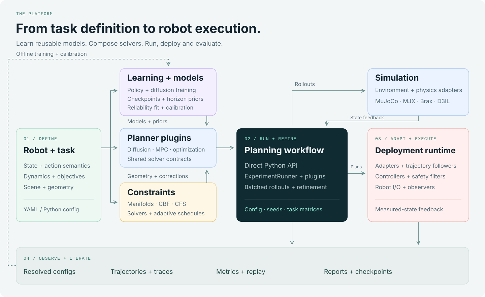

<h1 align="center">GenerativeDynamics</h1>

<p align="center">
  <strong>A modular engine for robot planning and control.</strong><br>
  Generative planning · Composable constraints · Closed-loop execution
</p>

<p align="center">
  <a href="docs/index.md">Documentation</a> ·
  <a href="#get-started">Get started</a> ·
  <a href="#explore-the-examples">Examples</a> ·
  <a href="#how-the-stack-fits-together">Architecture</a>
</p>

<p align="center">
  <a href="docs/getting-started/installation.md"></a>
  <a href="docs/reference/compatibility.md"></a>
  <a href="docs/releases/v1_scope.md"></a>
</p>

<p align="center">
  
</p>

<p align="center">
  <a href="docs/assets/showcase.mp4">Watch the full-quality video</a> ·
  <a href="docs/recipes/index.md">Try the task recipes</a>
</p>

GenerativeDynamics brings trajectory generation, geometric constraints,
simulation, and execution into one robotics stack. Define your robot and task,
then compose planners, safety mechanisms, and controllers around them. Shared
interfaces carry the work from a first planning run to a closed-loop system.

## Built to compose

- **One task, many planners.** Choose diffusion planning, sampling MPC,
  governed optimization, or contact-aware control. Reuse task definitions,
  configuration, and evaluation as you change methods.
- **Geometry that works with your planner.** Combine convex primitives, meshes,
  signed-distance geometry, and constructive solid geometry. Compose collision,
  state, action, and contact constraints through dedicated interfaces.
- **Plans connected to control.** Build receding-horizon workflows with
  controllers, governors, safety filters, recovery policies, and robot I/O.
  Observers record what was planned and what was executed.
- **Simulation as a replaceable layer.** Work with MuJoCo, MJX, Brax, and the
  D3IL integration. Keep physics and environment adapters separate from solver
  logic so tasks can share the surrounding tooling.
- **JAX-first computation.** Use batched rollouts and trajectory sampling with
  a portable CPU setup and a CUDA installation path. See the
  [compatibility guide](docs/reference/compatibility.md) for device support.
- **A stack you can extend.** Add planners, environments, metrics, and
  visualizations through plugins. Run YAML-defined task matrices, resume
  completed work, and inspect trajectories, metrics, and reports together.

## Get started

Run your first planner on CPU with Python 3.10–3.12. The planar example needs
the core package only.

```bash
git clone https://github.com/hhhhzl/enerdynamics.git
cd enerdynamics
python -m venv .venv
source .venv/bin/activate
python -m pip install -e .

genedynamics-run configs/single_2d/mbd.yaml \
  --device cpu --seed 0 --level 0 \
  --development-root results/_development/quickstart
```

The run saves its resolved configuration, trajectory, metrics, and status under
`results/_development/quickstart`. To try another planner, pass
[`configs/single_2d/ebmbd.yaml`](configs/single_2d/ebmbd.yaml) to the same runner.

Follow the [first-run guide](docs/getting-started/quickstart.md) to inspect results
and resume a multi-seed run. The [installation guide](docs/getting-started/installation.md)
covers simulator assets, CUDA, D3IL, learned planners, and deployment extras.

## Explore the examples

The same framework spans free-space motion, contact, and constrained robot tasks.
Each example starts from a configuration you can inspect and adapt.

| Task | What you can explore | Starting configuration |
| --- | --- | --- |
| **Planar navigation** | Trajectory generation in non-convex scenes | [MBD](configs/single_2d/mbd.yaml) |
| **D3IL obstacle avoidance** | Receding-horizon planning around obstacles | [EB-MBD](configs/d3il_avoiding/ebmbd.yaml) |
| **Quadruped stepping stones** | Multi-modal footholds and governed execution | [2GO](configs/quadruped/stepping_stones_2d/main/twogo.yaml) |
| **Humanoid corridor** | Body motion through constrained passages | [2GO](configs/humanoid/corridor_2d/main/twogo_zone_c.yaml) |
| **Peg insertion** | Contact transitions, insertion, and recovery | [MGA](configs/arm/peg_insert/main/mga.yaml) |
| **Surface scanning** | Surface geometry, compliance, and force regulation | [MGA](configs/arm/surface_scan/main/mga.yaml) |

See the [recipe catalogue](docs/recipes/index.md) for setup and task assets.

<details>
<summary><strong>Included planners and baselines</strong></summary>

| Approach | Methods |
| --- | --- |
| Model-based diffusion | MBD, EB-MBD |
| Constrained diffusion | MDOC, CFS-MBD; MDCOAS, MDCOAS-F, and MDCOAS-A configuration variants |
| Governed optimization | 2GO |
| Sampling MPC | MPPI |
| Contact-aware generative control | MGA |
| Contact-control baselines | DIAL, ATACOM, ISSA, PegasusFlow |
| Learned diffusion baselines | DPCC, SafeDiffuser — optional Torch integrations |
| Comparison policies | Model-based-only, standalone RL |

Methods are registered plugins. Task recipes define their dependency and asset
requirements; the [compatibility matrix](docs/reference/compatibility.md)
records the supported execution paths.

</details>

## How the stack fits together



Tasks own dynamics, objectives, and geometry. Planners generate trajectories.
The runtime connects them to environment adapters and control components, while
metrics and observers make their behavior visible. These boundaries let you
replace a solver or add a robot while reusing the application around it.

Read the [architecture guide](docs/concepts/architecture.md),
[configure a task](docs/guides/configuration.md), or
[add your first plugin](docs/guides/adding-a-plugin.md).

## Documentation

| Start building | Go deeper |
| --- | --- |
| [Installation](docs/getting-started/installation.md) | [Architecture](docs/concepts/architecture.md) |
| [First run](docs/getting-started/quickstart.md) | [Configuration](docs/guides/configuration.md) |
| [Task recipes](docs/recipes/index.md) | [Plugin development](docs/guides/adding-a-plugin.md) |
| [D3IL integration](docs/integrations/d3il.md) | [API reference](docs/api/README.md) |

## Status and roadmap

V1 (`0.1.0`) is the first open-source release candidate; the public API is still
evolving. The current solver stack is JAX-first, with dedicated Torch
integrations for DPCC and SafeDiffuser. Broader Torch support and Rust/C++
backends are planned. MGA GPU qualification and humanoid walking/push are
scheduled for a later release.

[Compatibility](docs/reference/compatibility.md),
[validation results](docs/releases/v1_evidence.md), and the
[benchmark methodology](docs/reference/metrics.md) document the current
support and measurement boundaries.

## Contributing

Bring a planner, a robot task, an integration, or a documentation improvement.
Start with [CONTRIBUTING.md](CONTRIBUTING.md). Community guidelines are in
[CODE_OF_CONDUCT.md](CODE_OF_CONDUCT.md); vulnerability reporting is in
[SECURITY.md](SECURITY.md).

## Research and citation

The solvers build on research algorithms; the framework provides the interfaces
and runtime around them. Use [CITATION.cff](CITATION.cff) when citing the project.

## License

License selection is pending for the public V1 release. The
[release checklist](docs/releases/v1_checklist.md) tracks this requirement.
