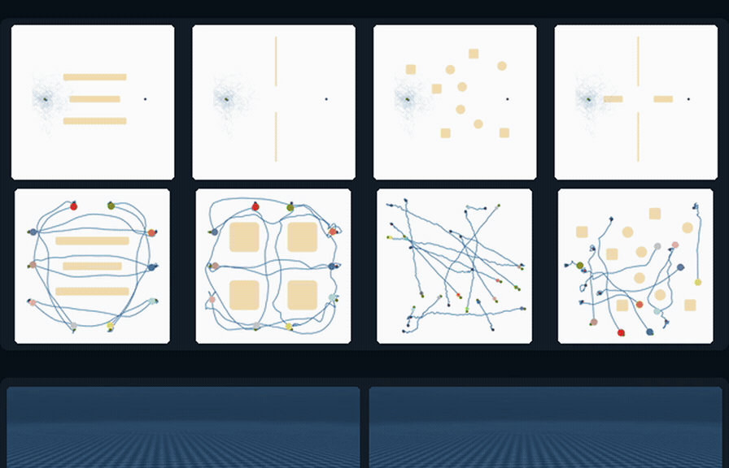
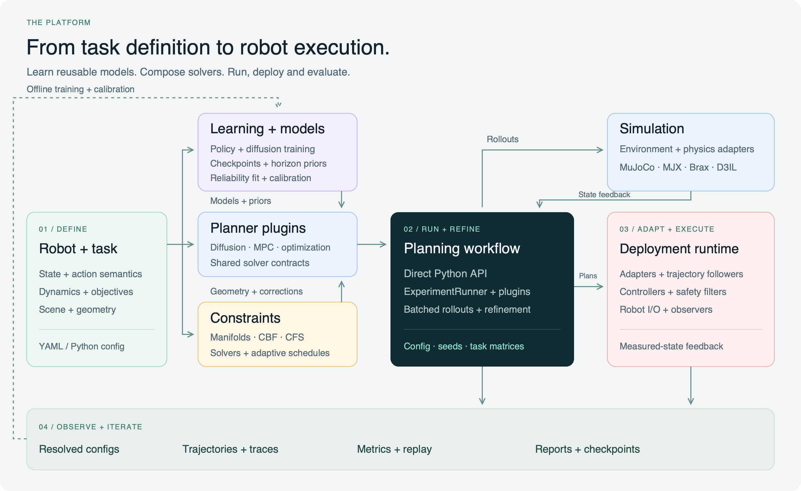

<h1 align="center">GenerativeDynamics</h1>

<p align="center">
  <strong>Generative dynamics on manifold.</strong><br>
  For robotics: <b>Planning.</b> <b>Control.</b> <b>Learning.</b>
</p>

<p align="center">
  <a href="https://hhhhzl.github.io/generative-dynamics/">Website (coming soon)</a> ·
  <a href="docs/index.md">Documentation</a> ·
  <a href="#get-started">Get started</a> ·
  <a href="#explore-the-examples">Examples</a> ·
  <a href="#learning-and-generative-models">Learning</a> ·
  <a href="#environments">Environments</a> ·
  <a href="#constraint-solvers">Constraints</a> ·
  <a href="#how-the-stack-fits-together">Architecture</a> ·
  <a href="#roadmap">Roadmap</a>
</p>

<p align="center">
  <a href="docs/getting-started/installation.md"></a>
  <a href="docs/reference/compatibility.md"></a>
  <a href="docs/releases/v1_scope.md"></a>
  <a href="LICENSE"></a>
</p>

<p align="center">
  
</p>

<p align="center">
  <a href="docs/assets/showcase.mp4">Full-quality video</a> ·
  <a href="docs/assets/README.md">Demonstrations and sources</a> ·
  <a href="#explore-the-examples">Run the examples</a>
</p>

GenerativeDynamics connects **generative models, manifold geometry, and robot
learning** in one modular robotics stack. Learn reusable priors, shape
generative trajectory updates with dynamics and constraints, and connect plans
to closed-loop control. Shared task, solver and execution
interfaces let you swap algorithms, compose controllers and add robots. Use
components directly in Python or run complete experiments from a configuration.

<a id="updates"></a>

## 📣 Updates

- **2026-10-09** — Added GPU and Docker quickstarts, a batched constraint example,
  and explicit device checks.
- **2026-10-09** — Added a direct Python planning example, a unified paper and
  hardware gallery, learning workflows, and planner, environment and constraint
  catalogues.
- **2026-10-05** — Prepared the V1 release candidate with six task families,
  optional integrations, user documentation and CPU validation evidence.

Follow [CHANGELOG.md](CHANGELOG.md) for new environments, planners and integrations.

<a id="built-to-compose"></a>

## 🧩 Built to compose

| Feature | What you get |
| --- | --- |
| **🧠 Robot learning** | PPO/SAC policy training, reusable checkpoints and PPO horizon priors for MGA. |
| **✨ Generative models** | Learned trajectory diffusion and model-based generative inference; DDPM/DDIM and flow-style reverse transports. |
| **🧭 Planning** | Interchangeable planners for constrained trajectories, sampling MPC and contact-rich motion–impedance optimization. |
| **🤖 Tasks and robots** | Planar navigation, 7-DoF avoidance, quadruped footholds, humanoid corridors, peg insertion and surface scanning. |
| **🛡️ Geometry and constraints** | Constraint manifolds, convex primitives, meshes, signed-distance geometry and CSG; collision, state, action and contact constraints. |
| **🌐 Simulation adapters** | MuJoCo, MJX, Brax and D3IL integrations, with physics and task adapters separate from solver logic. |
| **🧮 Batched constraints** | Evaluate and correct candidate trajectories inside generative inference with batched JAX kernels. |
| **⚡ Compute** | JAX planning and batched rollouts; CPU and CUDA installation paths. Dedicated Torch integrations for DPCC and SafeDiffuser. |
| **🎛️ Execution components** | Robot I/O, controllers, trajectory followers, governors, safety filters, recovery policies and observers. |
| **📊 Experiment tooling** | YAML task matrices, seeds, resumable runs, resolved configurations, metrics, traces, replay and reports. |
| **🔌 Extension points** | Registered planners, environments, geometry, metrics and visualizations; optional integrations with explicit dependencies. |

See [device and integration support](docs/reference/compatibility.md) for the
qualified paths, and [architecture](docs/concepts/architecture.md) for the
interfaces behind these features.

<a id="get-started"></a>

## 🚀 Get started

Create a planar environment, give it a **2GO** planner, and move from `(0.8, 0.8)`
to the origin. This example runs on CPU without a simulator or model checkpoint.

```bash
git clone https://github.com/hhhhzl/genedynamics.git
cd genedynamics
python -m venv .venv
source .venv/bin/activate
python -m pip install -e ".[optimization]"
```

```python
import jax
import numpy as np

from genedynamics.core.backends.runtime import RuntimeBackendManager
from genedynamics.envs import make_env, make_energy
from genedynamics.solvers import TwoGOSolver

RuntimeBackendManager.set_backend("jax", device="cpu")
env = make_env("single_integrator_box_2d")
planner = TwoGOSolver(
    dynamics=env,
    energy=make_energy("single_integrator_box_2d"),
    backend=RuntimeBackendManager.get_backend(),
    dt=env.dt,
    horizon=20,
    Nsample=128,
    Ndiffuse=16,
)

state = np.array([0.8, 0.8], dtype=np.float32)
for step in range(60):
    key = jax.random.fold_in(jax.random.PRNGKey(0), step)
    plan = planner.solve(state, horizon=20, rng_key=key)
    state = env.transition(state, plan.actions[0])
    if np.linalg.norm(state) < 0.1:
        break

print(f"Goal error: {np.linalg.norm(state):.3f}")
```

The CPU validation reaches the goal in 48 steps, with `Goal error: 0.099`.
Run the complete example with `python examples/plan_to_goal.py`, or follow the
[Python API walkthrough](docs/getting-started/python-api.md) to adapt it.

### ⚡ GPU and Docker

On Linux with an NVIDIA GPU, install the CUDA stack and increase the candidate
batch without changing the application loop:

```bash
python -m pip install -e ".[optimization]" \
  -r requirements/gpu-jax.txt "jax[cuda12]==0.6.2"
JAX_PLATFORMS=cuda python examples/plan_to_goal.py --device gpu --samples 1024
JAX_PLATFORMS=cuda python examples/batched_constraints.py --device gpu --samples 4096
```

The examples check array placement and fail when the requested GPU is
unavailable. The [GPU recipes](docs/recipes/gpu-planning.md) cover MDOC,
MD-COAS, 2GO and batched constraints. MGA CUDA qualification is deferred.

With the existing development images, mount the checkout and run the same loop:

```bash
docker run --rm -v "$PWD:/workspace" -w /workspace \
  genedynamics/dev-cpu:local python examples/plan_to_goal.py --device cpu

docker run --rm --gpus all -v "$PWD:/workspace" -w /workspace \
  -e JAX_PLATFORMS=cuda genedynamics/train-gpu:local \
  python examples/plan_to_goal.py --device gpu --samples 1024
```

The NVIDIA container requires Linux and the NVIDIA Container Toolkit. Results
remain in the mounted checkout. See the [Docker guide](docker/README.md) for
prerequisites, batch examples and headless simulation.

For configured experiments, the [first-run guide](docs/getting-started/quickstart.md)
covers result artifacts and resuming runs. The [installation guide](docs/getting-started/installation.md)
covers CUDA, simulator assets, learned planners and deployment extras.

<a id="explore-the-examples"></a>

## 🧪 Explore the examples

Start with one of our four methods. Each recipe connects an algorithm to a task,
its dependencies and an inspectable configuration.

| Method | Explore | Starting configurations |
| --- | --- | --- |
| **[MDOC](https://arxiv.org/abs/2607.12423)** | Diffusion planning with safety projections in constrained scenes. | [Planar navigation](configs/single_2d/mdoc.yaml) |
| **[MD-COAS](https://arxiv.org/abs/2607.14455)** | Constraint-guided diffusion, from planar obstacles to 7-DoF avoidance. | [Planar navigation](configs/single_2d/mdcoas.yaml) · [Arm avoidance](configs/d3il_avoiding/mdcoas.yaml) |
| **[2GO](https://arxiv.org/abs/2610.07772)** | Geometry-guided trajectory optimization for constrained locomotion. | [Quadruped stepping stones](configs/quadruped/stepping_stones_2d/main/twogo.yaml) · [Humanoid corridor](configs/humanoid/corridor_2d/main/twogo_zone_c.yaml) |
| **MGA** | Learned policy priors and generative motion–impedance control for contact-rich tasks. | [Peg insertion](configs/arm/peg_insert/main/mga.yaml) · [Surface scanning](configs/arm/surface_scan/main/mga.yaml) |

The [recipe catalogue](docs/recipes/index.md) explains setup and assets. The
homepage also includes original paper demonstrations: MDOC multi-robot
coordination is available in its [original project](https://github.com/hhhhzl/mdoc),
and MGA humanoid contact footage previews research beyond the qualified V1
recipes. See the [demo map](docs/assets/README.md) for the distinction.

<a id="learning-and-generative-models"></a>

## ✨ Learning and generative models

Generative models are part of the architecture: learn a trajectory distribution,
reuse a policy as a control-sequence prior, or perform model-based generative
inference directly from dynamics and objectives.

| Workflow | How it connects | Start here |
| --- | --- | --- |
| **Learn a policy, refine its proposals** | Train PPO/SAC policies; reuse PPO checkpoints as MGA horizon priors for constrained, model-based refinement. | [MGA learning workflow](docs/guides/learning-and-priors.md#mga-train-a-policy-and-reuse-it-as-a-prior) |
| **Learn a trajectory diffusion model** | Train on offline sequences, then guide denoising with DPCC projections or SafeDiffuser constraints. | [Learned diffusion workflow](docs/guides/learning-and-priors.md#learned-trajectory-diffusion) |
| **Plan without a pretrained model** | Use physics rollouts, objectives and constraints to construct model-based generative updates. | [MDOC, MD-COAS and 2GO recipes](docs/recipes/index.md) |

Learning dependencies and checkpoint setup are documented in the
[learning guide](docs/guides/learning-and-priors.md).

<a id="environments"></a>

## 🌍 Environments

Six task families share the planning and evaluation stack. Each links to a
ready-to-inspect configuration.

| Environment | What you can explore | Example |
| --- | --- | --- |
| **Planar navigation** | Point-robot planning in non-convex scenes, with state and action bounds. | [MD-COAS](configs/single_2d/mdcoas.yaml) |
| **7-DoF arm avoidance** | D3IL obstacle avoidance through Cartesian or joint-velocity interfaces. | [MD-COAS](configs/d3il_avoiding/mdcoas.yaml) |
| **Quadruped stepping stones** | Body motion, foot placement and gait phase across discrete footholds. | [2GO](configs/quadruped/stepping_stones_2d/main/twogo.yaml) |
| **Humanoid corridor** | Body position, posture and arm clearance through narrow passages. | [2GO](configs/humanoid/corridor_2d/main/twogo_zone_a.yaml) |
| **Surface scanning** | Contact tracking, stiffness and force regulation across surfaces. | [MGA](configs/arm/surface_scan/main/mga.yaml) |
| **Peg insertion** | Contact-rich insertion under pose, clearance, friction and sensing variations. | [MGA](configs/arm/peg_insert/main/mga.yaml) |

The [environment catalogue](docs/reference/environments.md) lists configuration
keys, interfaces, assets and implementation links. MuJoCo, MJX and Brax are
simulation adapters; support depends on the selected recipe.

<a id="included-planners-and-baselines"></a>

## 🧠 Included planners and baselines

🟢 **Ours** marks our algorithms. Each entry links its original paper or current
implementation; configuration variants are documented in the
[planner reference](docs/reference/planners.md).

| Algorithm | What it does | Source |
| --- | --- | --- |
| **MDOC** 🟢 Ours | Model-based diffusion with control-barrier-function projections inside dynamics rollouts. | [Paper](https://arxiv.org/abs/2607.12423) · [Original multi-robot project](https://github.com/hhhhzl/mdoc) |
| **MD-COAS** 🟢 Ours | Combines an augmented-Lagrangian feasibility prior, CFS projection, and adaptive constraint scheduling. | [Paper](https://arxiv.org/abs/2607.14455) |
| **2GO** 🟢 Ours | Shapes generative trajectory updates and exploration with active constraint geometry for constrained locomotion. | [Paper](https://arxiv.org/abs/2610.07772) |
| **MGA** 🟢 Ours | Combines RL sequence proposals, model-based evaluation, and realization-aware geometry for motion–impedance control. | [Implementation](https://github.com/hhhhzl/genedynamics/tree/main/genedynamics/solvers/single/mga) |
| **MBD** | Uses known dynamics and Monte Carlo score estimates to optimize trajectories without demonstrations. | [Paper](https://arxiv.org/abs/2407.01573) · [Project](https://lecar-lab.github.io/mbd/) |
| **EB-MBD** | Introduces emerging barriers during model-based diffusion to retain useful samples under constraints. | [Paper](https://arxiv.org/abs/2510.07700) |
| **MPPI** | Updates sampled control sequences using exponential rollout-cost weights. | [Paper](https://arxiv.org/abs/1707.02342) |
| **DIAL-MPC** | Uses diffusion-inspired annealing to refine sampled controls in receding-horizon MPC. | [Paper](https://arxiv.org/abs/2409.15610) |
| **ATACOM** | Learns and executes actions in the tangent space of an augmented constraint manifold. | [Paper](https://proceedings.mlr.press/v164/liu22c.html) |
| **ISSA** | Filters proposed actions through a derivative-free implicit-safe-set search. | [Paper](https://proceedings.mlr.press/v164/zhao22a.html) |
| **PegasusFlow** | Uses rolling denoising and weighted spline-basis updates for model-based trajectory optimization. | [Paper](https://arxiv.org/abs/2509.08435) |
| **DPCC** | Adds model-based projections and constraint tightening to learned trajectory diffusion. | [Paper](https://proceedings.mlr.press/v283/romer25a.html) |
| **SafeDiffuser** | Applies control-barrier-function corrections within learned diffusion denoising. | [Paper](https://arxiv.org/abs/2306.00148) |

**Naming:** CFS-MBD is the historical implementation name for **MD-COAS**.
Learned integrations require their optional dependencies and
checkpoints. See [planner setup and implementation notes](docs/reference/planners.md).

<a id="constraint-solvers"></a>

## 🛡️ Constraint solvers

Compose [CBF action filters](genedynamics/core/constraints/action_filters/cbf_qp.py),
[CFS trajectory projections](genedynamics/core/constraints/action_filters/cfs_qp_full.py)
and [adaptive augmented-Lagrangian scheduling](genedynamics/core/constraints/schedulers/ConstraintScheduler/almadaptive/alm_adaptive.py)
with a numerical solver below.

| Solver | What it does | Source |
| --- | --- | --- |
| **Closed form** | Euclidean halfspace projection, box clipping and unconstrained solves for special cases. | [Implementation](genedynamics/core/constraints/solvers/closed_form.py) |
| **JAXopt OSQP** | General convex-QP interface built on `jaxopt.OSQP`. | [Implementation](genedynamics/core/constraints/solvers/jaxopt_osqp_solver.py) · [Docs](https://jaxopt.github.io/stable/quadratic_programming.html) |
| **OSQP** | Sparse CPU convex-QP solves through the OSQP Python interface. | [Implementation](genedynamics/core/constraints/solvers/osqp_solver.py) · [Docs](https://osqp.org/docs/) |
| **CVXOPT** | CPU convex-QP solves, including trajectory smoothness and slack formulations. | [Implementation](genedynamics/core/constraints/solvers/cvxopt_solver.py) · [Docs](https://cvxopt.org/userguide/coneprog.html#quadratic-programming) |

Install `.[optimization]` for the optional QP dependencies. See the
[constraint reference](docs/reference/constraints.md) for CBF/CFS variants,
scheduling and solver-specific limits.

### Constraints inside generative inference

A planning call maintains a **batch of candidate trajectories**. Constraints
participate in the sampling loop: they correct candidates, change feasibility
weights, or shape the geometry of the next generative update.

| Axis | How the work composes |
| --- | --- |
| **Candidates `N`** | JAX `vmap` applies supported rollout, filter and projection kernels across trajectories. |
| **Horizon `H`** | Stateful filters use `scan`: correct an action, propagate dynamics, then evaluate the next state. Full-horizon CFS couples the sequence. |
| **Refinement `K`** | Constraint feedback shapes successive denoising or optimization steps. |

MDOC/MD-COAS compose CBF/CFS corrections; 2GO budgets projection probes; MGA
evaluates learned horizon proposals alongside model-based candidates.
SafeDiffuser uses batched Torch QPs during denoising; DPCC combines Torch
sampling with CPU trajectory projections. Numerical paths are documented
per integration.

See [batched constraints and generative samples](docs/guides/batched-constraints.md)
for tensor shapes, each planner's data flow and a runnable JAX batch example.

<a id="how-the-stack-fits-together"></a>

## 🏗️ How the stack fits together



Define a **robot task**, then compose **planner plugins**, **constraints and
geometry**, and **learned models or priors**. Run through the experiment framework
or direct Python API. Environment adapters connect to simulation; explicit
trajectory adapters connect selected plans to the separate deployment stack.

**Observers, metrics and replay** span the workflow. Saved trajectories and
outcomes support offline policy training, diffusion-model training and
reliability calibration. Each workflow selects the components it needs;
model-based planners can also run without learned checkpoints.

Read the [architecture guide](docs/concepts/architecture.md),
[configure a task](docs/guides/configuration.md), or
[add a plugin](docs/guides/adding-a-plugin.md).

<a id="roadmap"></a>

## 🗺️ Roadmap

- [x] Policy learning, learned diffusion and reusable priors
- [x] JAX planning and composable constraints
- [x] Six task families and planner baselines
- [x] Configured experiments, metrics and replay
- [ ] MGA CUDA qualification and humanoid walking/push
- [ ] Torch planner parity; Rust/C++ control and I/O
- [ ] Panda/xArm7 controllers and `ros2_control`
- [ ] Async planning/control and fault recovery
- [ ] VLA proposals and OpenPI/LeRobot adapters
- [ ] Live perception and dynamic scenes
- [ ] Reproducible hardware benchmarks

[Roadmap details](docs/reference/roadmap.md) ·
[Current compatibility](docs/reference/compatibility.md) ·
[Validation evidence](docs/releases/v1_evidence.md)

<a id="documentation"></a>

## 📚 Documentation

| Start building | Go deeper |
| --- | --- |
| [Installation](docs/getting-started/installation.md) | [Architecture](docs/concepts/architecture.md) |
| [Python API example](docs/getting-started/python-api.md) | [Planners and sources](docs/reference/planners.md) |
| [Learning and model priors](docs/guides/learning-and-priors.md) | [Batched constraints](docs/guides/batched-constraints.md) |
| [Configured experiments](docs/getting-started/quickstart.md) | [Plugin development](docs/guides/adding-a-plugin.md) |
| [Environments](docs/reference/environments.md) | [Constraint solvers](docs/reference/constraints.md) |
| [Task recipes](docs/recipes/index.md) | [Metrics and benchmarks](docs/reference/metrics.md) |
| [D3IL integration](docs/integrations/d3il.md) | [API reference](docs/api/README.md) |

<a id="contributing"></a>

## 🤝 Contributing

Bring a planner, a robot task, an integration or a documentation improvement.
Start with [CONTRIBUTING.md](CONTRIBUTING.md). Community guidelines are in
[CODE_OF_CONDUCT.md](CODE_OF_CONDUCT.md); vulnerability reporting is in
[SECURITY.md](SECURITY.md).

<a id="research-and-citation"></a>

## 📖 Research and citation

The solvers build on research algorithms; the framework provides the interfaces
and runtime around them. Use [CITATION.cff](CITATION.cff) when citing the project,
and the papers linked above when using individual methods.

<a id="license"></a>

## 📄 License

GenerativeDynamics is released under the [MIT License](LICENSE).
Bundled third-party components retain their own licenses; see
[third-party notices](THIRD_PARTY_NOTICES.md).
