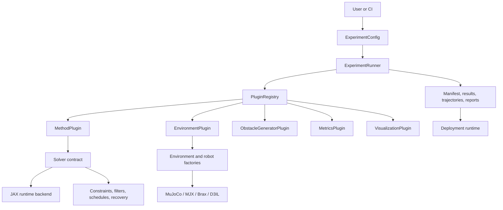

# Architecture

GenerativeDynamics separates the research algorithm from the machinery needed
to run it repeatedly and compare it fairly.

## Ownership boundaries

### Configuration owns the protocol

`ExperimentConfig` owns method/environment selection, seeds, suites, device,
metrics, visualization, and output identity. Relative `base:` chains merge
dictionaries recursively and replace scalar/list values deterministically.

### Plugins adapt components

Plugins translate a stable runner interface into solver-, environment-, or
task-specific calls. They keep conditional logic out of the runner and give
registrations explicit names that YAML can reference.

### Solvers own planning mathematics

Solvers operate on dynamics, objectives, constraints, random keys, and schedule
parameters. They do not choose result paths, render figures, or aggregate
multi-seed experiments.

### Environments own state and execution semantics

Environment plugins create model environments and, where required, distinct
execution environments. Contact tasks can keep structured simulator state and
provide task-owned reset, position extraction, recovery, and reliability
contracts.

### The runner owns evidence

The runner validates configuration, expands suite/seed matrices, persists
success and failure state, invokes metrics and visualizations, and aggregates
numeric results. A failed matrix entry remains visible rather than appearing as
a successful partial run.

### Deployment is a separate runtime

Deployment composes robot I/O, controllers, tasks, safety filters, observers,
and localization through registries. Planning outputs cross into deployment
through explicit adapters and saved artifacts instead of simulator internals.

## Why this is an industrial architecture

The framework makes replaceability and evidence first-class. A planner can be
changed without creating a new result format; a simulator can be changed
without rewriting method selection; a benchmark can identify its exact config
and device; and an incomplete run records its failure. These boundaries are
what turn paper algorithms into maintainable application components.

## Backend boundary

V1 solver implementations target JAX. NumPy supports utilities and adapters.
Torch supports a runtime adapter and specialized learned planners, but is not a
general replacement for JAX solvers. Rust and C++ require the same tensor,
randomness, compilation, device, and serialization contracts before they can
be advertised as backends.
